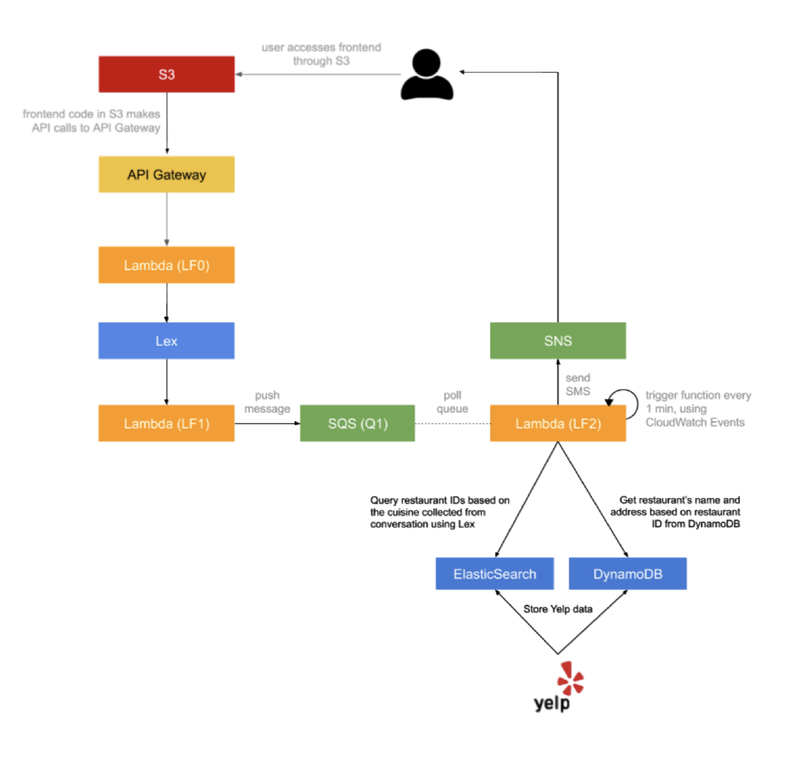
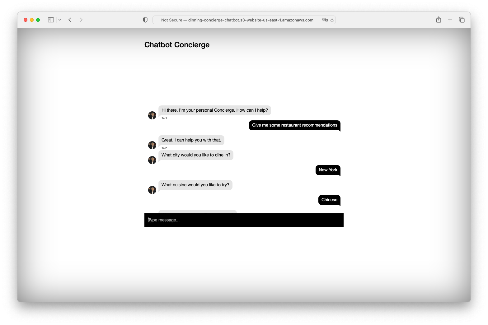
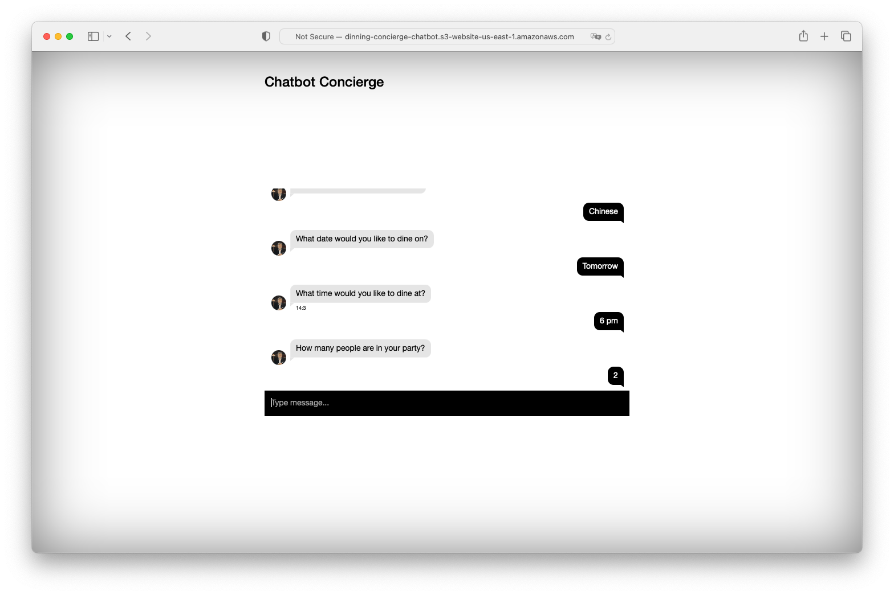

# AI Dining Concierge Chatbot

A serverless, microservice-driven Dining Concierge Chatbot that provides restaurant suggestions based on user preferences through conversation. Built using AWS services such as Amazon Lex, API Gateway, AWS Lambda, Amazon S3, SQS, DynamoDB, OpenSearch, and SES.

## Live Demo

Visit the live demo [here](http://dinning-concierge-chatbot.s3-website-us-east-1.amazonaws.com).

## Features

- Conversational UI with Amazon Lex
- Serverless architecture with AWS Lambda
- Frontend hosted on Amazon S3
- API built with Amazon API Gateway
- Scraped Yelp restaurant data storage using Amazon DynamoDB and OpenSearch
- Notifications via Amazon SES
- Automated queue worker using Amazon SQS

## Usage

1. Visit the live demo and start a conversation with the chatbot.
2. Provide location (currently supports NYC only), cuisine preference, dining date & time, number of guests, and email.
3. Receive restaurant suggestions via email (AWS SES service disabled).

## AWS Architecture

## Screenshots

_Example of Chatbot conversation_

_Example of Chatbot conversation_
